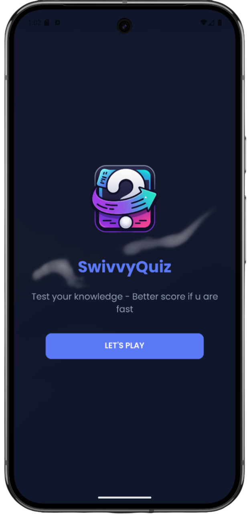
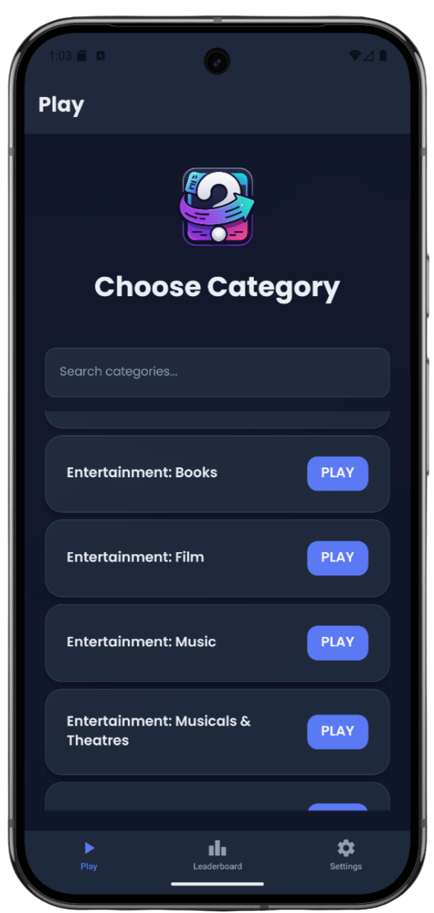
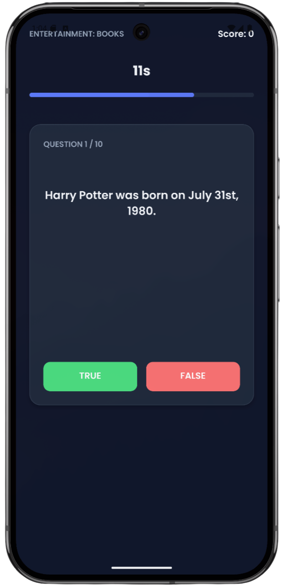
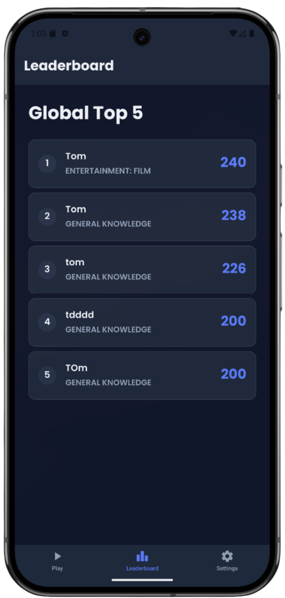

<p align="center">
  
</p>

# SwivvyQuiz APP

SwivvyQuiz is a trivia app built with React Native and Expo, featuring True/False questions across multiple categories and a global leaderboard powered by Firebase. Developed as a school project, the primary focus was on code structure, logic, and learning rather than UI design.

---

# Screenshots

<p align="center">
  
  
  
  
</p>

---

# Features

- 🔎 **Category Search**: Easily filter through dozens of trivia categories from the Open Trivia Database.
- ⏱️ **Timed Challenges**: Quick-fire True/False questions with a countdown timer for each round.
- 🏆 **Global Leaderboard**: Save your best scores to a shared leaderboard hosted on Firebase Firestore.
- 📋 **Tab-based Navigation**: Seamlessly switch between the home screen, high scores, and settings.
- ⏳ **Polished UI**: Loading states, error handling, and a consistent theme using the Poppins typeface.
- 📱 **Mobile-First Design**: Fully responsive layout optimized for both iOS and Android.

---

# Tech Stack

- **React Native & Expo**: Core framework.
- **TypeScript**: Type safety across the app.
- **Expo Router**: File-based navigation and tabs.
- **Firebase Firestore**: Persistent leaderboard.

---

# API

API used in this project:

**Open Trivia Database (OTDB)**

Example endpoints:

    GET https://opentdb.com/api.php?amount=10&category=9&type=boolean
    GET https://opentdb.com/api_category.php

Example response:

```json
{
  "response_code": 0,
  "results": [
    {
      "category": "Entertainment: Video Games",
      "type": "boolean",
      "difficulty": "easy",
      "question": "The logo for Snapchat is a bell.",
      "correct_answer": "False",
      "incorrect_answers": ["True"]
    }
  ]
}
```

---

# Technical Decisions

## Expo Router

Utilized for intuitive file-based routing, including layout groups and tab-based navigation patterns.

## Firebase Integration

Chosen for the high score system to provide a real-time, persistent leaderboard without the need for a dedicated custom backend.

## Service Layer & Custom Hooks

API logic is encapsulated in a dedicated service layer, while complex game state and async operations are managed via custom hooks (`useQuizGame`, `useAsync`) to maintain clean components.

---

# 🗂 Project Structure

    /src
       /app           # Expo Router screens (Layouts, Tabs, Quiz)
       /components    # Reusable UI components (Button, Card, etc.)
       /hooks         # Custom React hooks for logic and state
       /lib           # Firebase client and third-party initializations
       /services      # API services (Trivia service)
       /theme         # Design system, colors, and global styles
       /types         # Shared TypeScript interfaces and types

**Explanation:**

- `src/app/` → File-based routing and navigation structure.
- `src/components/ui/` → Atomic UI components for a consistent look and feel.
- `src/lib/` → Configuration for external services like Firebase.
- `src/hooks/` → Reusable logic for data fetching and game mechanics.

---

# ⚙️ Installation

1. **Clone the repository:**

   ```bash
   git clone https://github.com/tlxq/SwivvyQuiz.git
   cd SwivvyQuiz
   ```

2. **Install dependencies:**

   ```bash
   npm install
   ```

3. **Configure Environment Variables:**

   Create a `.env` file in the root directory and add your Firebase credentials:

   ```env
   EXPO_PUBLIC_FIREBASE_API_KEY=your_key
   EXPO_PUBLIC_FIREBASE_AUTH_DOMAIN=your_domain
   EXPO_PUBLIC_FIREBASE_PROJECT_ID=your_id
   EXPO_PUBLIC_FIREBASE_STORAGE_BUCKET=your_bucket
   EXPO_PUBLIC_FIREBASE_MESSAGING_SENDER_ID=your_sender_id
   EXPO_PUBLIC_FIREBASE_APP_ID=your_app_id
   ```

4. **Start the project:**

   ```bash
   npx expo start
   ```

Open the project in **Expo Go** or an emulator.

---

# Error Handling & Validation

- **Async States**: Centralized handling of loading, error, and data states via the `useAsync` hook.
- **Graceful Failures**: Try/catch blocks in services with user-friendly alerts for API or Database issues.
- **Input Validation**: Ensuring usernames are provided before saving to the leaderboard.

---

# Learning Goals

- Set up and structure an Expo project with TypeScript.
- Implement navigation between screens using Expo Router.
- Organize the app for clarity, modularity, and maintainability.
- Build reusable components and custom hooks in React.
- Manage state and side effects effectively (useState, useEffect).
- Type props, API responses, and functions safely with TypeScript.
- Call public APIs, handle loading/error states, and implement search/filter.
- Apply DRY principles and write robust, maintainable code.
- Learn independently, read documentation, and justify technical decisions.

---

# Sources

- [React Native Documentation](https://reactnative.dev/)
- [Expo Documentation](https://docs.expo.dev/)
- [Open Trivia DB API](https://opentdb.com/api_config.php)
- [Firebase Documentation](https://firebase.google.com/docs)

---

# Author

<b>Tom Larsson</b>

School project -- App Development
F25D - Yrkeshögskolan i Borås
2026

---

# 🎓 Grading Requirements Fulfillment

## G

- **At least 3 screens**: Uses Expo Router for setup, quiz, settings, and high score screens.
- **Fetch data from an external public API**: Integrates Open Trivia Database.
- **Use at least 2 endpoints**: Uses `api_category.php`, `api_count_global.php`, and `api.php`.
- **Display loading and error states**: `useAsync` custom hook uniformly manages loading and error states visible in the UI.
- **App works without errors**: Graceful error handling prevents crashes.
- **Clear code structure**: Organized `/src` structure.
- **TypeScript**: No `any` used, properly typed props, and typed API responses. No TS compile errors.
- **React**: Clean component split, safe state updates, and no unnecessary re-renders (using `useMemo` and `useCallback`).

## VG

- **Dynamic routing**: Navigation from category list to a dynamic quiz screen using `id` and `categoryName` parameters.
- **Search/filter functionality**: Users can text-search for categories on the home screen. Categories are also pre-filtered internally so only those with boolean questions are shown.
- **Extra app functionality**: Fully working timer, scoring system, and global Firestore leaderboard.
- **Use custom hooks**: `useQuizGame`, `useAsync`, and `useHighScore` cleanly separate business logic from the UI.
- **Single responsibility**: Components like `ProgressBar`, `Card`, and `Button` have a single, dedicated purpose.
- **Robust error handling**: Handled 429 rate limit errors and empty data gracefully. Centralized configurations ensure scalability.
- **Best practices**: Implemented DRY code principles by extracting duplicated code, utilizing a single source of truth in `src/config/triviaConfig.ts`, and leveraging `React.memo` and `useMemo` for performance optimization.
